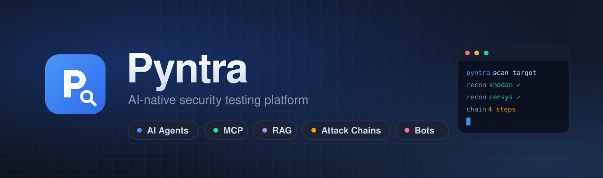
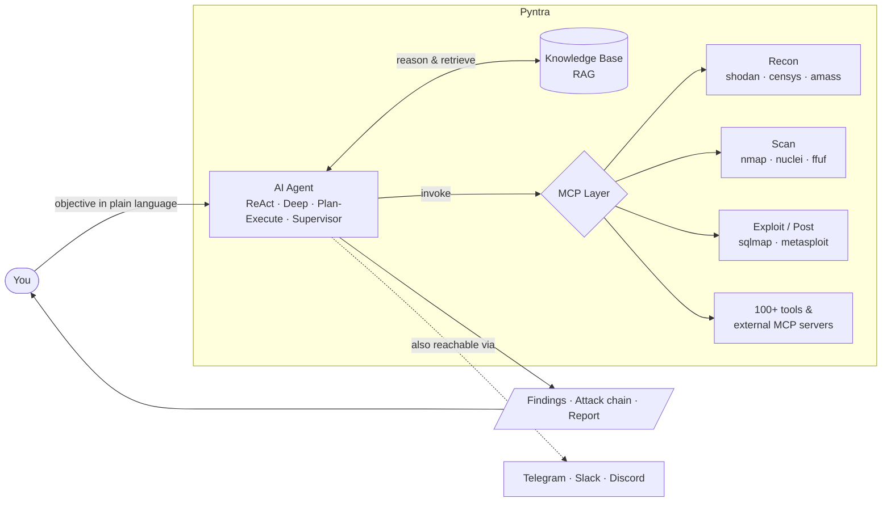
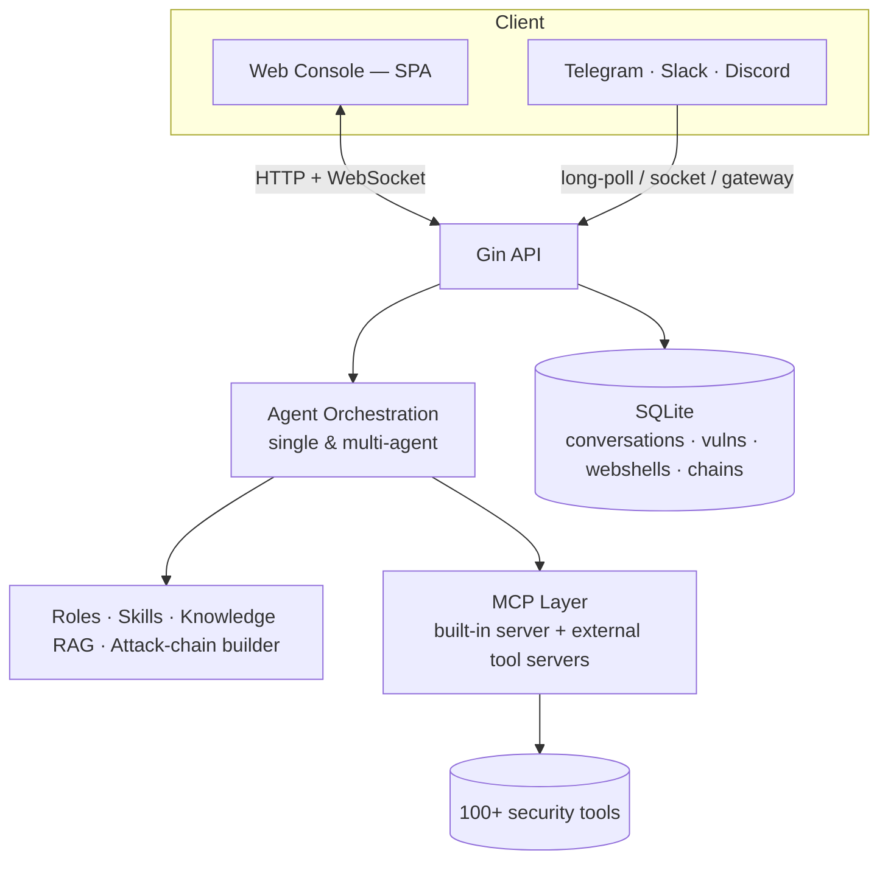

<div align="center">



<br>

**Drive AI agents through the full offensive-security lifecycle — from a single web console or a chat message.**

<p>
  <a href="https://go.dev/dl/"></a>
  <a href="LICENSE"></a>
  
  
  
  
</p>

<a href="#-installation"><b>Install</b></a> ·
<a href="#-configuration"><b>Configure</b></a> ·
<a href="#-setup-guides"><b>Setup guides</b></a> ·
<a href="#-usage"><b>Usage</b></a> ·
<a href="#-architecture"><b>Architecture</b></a>

</div>

---

Pyntra orchestrates **100+ security tools** over the [Model Context Protocol (MCP)](https://modelcontextprotocol.io), reasons about findings, builds **attack chains**, retrieves from a **security knowledge base**, and keeps every step auditable. You describe the objective in plain language; the agent plans, runs tools, correlates results, and reports back.

> [!WARNING]
> **Authorized use only.** Pyntra is for penetration testing and security research on systems you **own or are explicitly authorized to test**. You are responsible for complying with all applicable laws and rules of engagement.

<details>
<summary><b>📑 Table of contents</b></summary>

- [Highlights](#-highlights)
- [How it works](#-how-it-works)
- [Installation](#-installation)
- [Configuration](#-configuration)
- [Setup guides](#-setup-guides)
  - [LLM backend](#llm-backend-ollama--openai--claude)
  - [Recon API keys (Shodan / Censys)](#recon-api-keys-shodan--censys)
  - [Chat bots (Telegram / Slack / Discord)](#chat-bots-telegram--slack--discord)
- [Usage](#-usage)
- [Tool catalog](#-tool-catalog)
- [Architecture](#-architecture)
- [Roadmap](#-roadmap)
- [Contributing](#-contributing)
- [License](#-license)

</details>

## ✨ Highlights

| | Feature | What it does |
|---|---|---|
| 🧠 | **AI orchestration** | Single-agent (ReAct) and multi-agent modes — **Deep**, **Plan-Execute**, and **Supervisor** — that plan, act, and self-correct. |
| 🔌 | **Native MCP** | A built-in MCP server plus first-class integration of external MCP tool servers. |
| 🎭 | **Role-based testing** | Predefined security roles with scoped prompts and restricted tool access (recon, web, cloud, CTF, forensics…). |
| 🧩 | **Skills system** | Modular skill packages for domains like SQLi, XSS, SSRF, IDOR, and API security. |
| 📚 | **Knowledge base (RAG)** | Vector retrieval over your own security knowledge, with local-embedding support. |
| 🕸️ | **Attack-chain graphing** | Visualize, score, and replay multi-step testing sequences. |
| 🐚 | **Vuln & WebShell management** | Track findings and manage remote sessions from the console. |
| 🔎 | **Internet recon** | Built-in **Shodan** and **Censys** search tools for asset discovery. |
| 💬 | **Chat access** | Optional **Telegram**, **Slack**, and **Discord** bots — test on the go, keep per-chat context. |
| 🌗 | **Modern web console** | Clean single-page dashboard with light/dark themes. |
| 🏠 | **Runs fully local** | Point it at [Ollama](https://ollama.com) for an offline setup, or use any OpenAI-compatible / Anthropic Claude endpoint. |

## 🧭 How it works



## 🚀 Installation

### Prerequisites

| Requirement | Notes |
|---|---|
| **[Go 1.25+](https://go.dev/dl/)** | To build the server. |
| **An LLM endpoint** | A local **[Ollama](https://ollama.com)** install (recommended, fully offline), or any OpenAI-compatible / Claude API key. |
| **Python 3** *(optional)* | Only needed for a few Python-based tools (e.g. `shodan_search`, `censys_search`). |
| **Security CLIs** *(optional)* | `nmap`, `nuclei`, `ffuf`, `amass`, … — install the ones you plan to use; the agent uses whatever is on `PATH`. |

### 1 — Clone

```bash
git clone https://github.com/prnvv2/pyntra.git
cd pyntra
```

### 2 — Start a local model (recommended)

```bash
# Install Ollama from https://ollama.com, then pull a model:
ollama pull llama3.1:8b
```

Set `openai.model: llama3.1:8b` in `config.yaml` (the `base_url` already points at Ollama by default).

### 3 — Build & run

```bash
go build -o pyntra ./cmd/server
./pyntra                     # Windows: .\pyntra.exe
```

Open the console at **http://localhost:8080** and log in with the password from `config.yaml`.

> [!IMPORTANT]
> **Change the default password (`Root@1234`) before exposing Pyntra to any network.** Edit `auth.password` in `config.yaml` or update it from the **Settings** page.

<details>
<summary><b>🏠 Fully offline quickstart with Ollama</b></summary>

1. Install [Ollama](https://ollama.com) and pull a model (`ollama pull llama3.1:8b`).
2. Leave `openai.base_url: http://localhost:11434/v1` and `openai.api_key: ollama` in `config.yaml`.
3. Set `openai.model` to your pulled model.
4. `go build -o pyntra ./cmd/server && ./pyntra`

See **[OLLAMA_QUICKSTART.md](OLLAMA_QUICKSTART.md)** for details.

</details>

## ⚙️ Configuration

Everything lives in [`config.yaml`](config.yaml) and most of it is editable from the **Settings** page in the web console.

| Section | Controls |
|---|---|
| `server` | Listen host and port (default `0.0.0.0:8080`). |
| `auth` | Web login password and session length — **change `Root@1234`**. |
| `openai` | LLM `provider` (`openai` \| `claude`), `base_url`, `api_key`, `model`. |
| `agent` | Max ReAct iterations before the agent summarizes. |
| `multi_agent` | Enable multi-agent mode and pick the default orchestration. |
| `knowledge` | Embedding model and RAG retrieval settings. |
| `bots` | Telegram / Slack / Discord chat bots. |
| `mcp` | Built-in MCP server and external MCP tool servers. |
| `roles_dir` · `skills_dir` · `tools_dir` · `agents_dir` | Where roles, skills, tools, and sub-agents are loaded from. |

## 🔑 Setup guides

### LLM backend (Ollama / OpenAI / Claude)

<details>
<summary><b>Ollama (local, offline)</b></summary>

```yaml
openai:
  provider: openai
  base_url: http://localhost:11434/v1
  api_key: ollama          # any non-empty value
  model: llama3.1:8b
```
</details>

<details>
<summary><b>OpenAI-compatible API</b></summary>

```yaml
openai:
  provider: openai
  base_url: https://api.openai.com/v1
  api_key: sk-...
  model: gpt-4o
```
Any OpenAI-protocol endpoint works — just point `base_url` at it.
</details>

<details>
<summary><b>Anthropic Claude</b></summary>

```yaml
openai:
  provider: claude          # bridges to the Anthropic Messages API
  base_url: https://api.anthropic.com
  api_key: sk-ant-...
  model: claude-sonnet-4
```
</details>

### Recon API keys (Shodan / Censys)

The `shodan_search` and `censys_search` tools read credentials from **environment variables** at launch (nothing is written to disk):

```bash
# Shodan — https://account.shodan.io
export SHODAN_API_KEY="your-key"

# Censys — https://search.censys.io/account/api
export CENSYS_API_ID="your-id"
export CENSYS_API_SECRET="your-secret"

./pyntra
```

Both tools are enabled and attached to the **Information Collection** role out of the box.

### Chat bots (Telegram / Slack / Discord)

Enable one or more bots in the `bots:` block of `config.yaml`. Each bot keeps a **per-chat conversation** — send `/new` to reset it, `/help` for commands.

<details>
<summary><b>Telegram</b> — zero extra setup</summary>

1. Message **[@BotFather](https://t.me/BotFather)** → `/newbot` → copy the token.
2. Configure:
   ```yaml
   bots:
     telegram:
       enabled: true
       token: "123456:ABC-DEF..."
       role: ""          # optional role name from roles/
   ```
3. Restart Pyntra and DM your bot.
</details>

<details>
<summary><b>Slack</b> — Socket Mode</summary>

1. Create an app at **[api.slack.com/apps](https://api.slack.com/apps)**.
2. Enable **Socket Mode** → generate an app-level token (`xapp-…`).
3. Add bot scopes (`chat:write`, `app_mentions:read`, `im:history`) → install → copy the bot token (`xoxb-…`).
4. Subscribe to `message.im` / `app_mention` events.
5. Configure:
   ```yaml
   bots:
     slack:
       enabled: true
       app_token: "xapp-..."
       bot_token: "xoxb-..."
   ```
</details>

<details>
<summary><b>Discord</b> — gateway bot</summary>

1. Create an app at the **[Discord Developer Portal](https://discord.com/developers/applications)** → **Bot** → copy the token.
2. Enable the **Message Content Intent** under the bot settings.
3. Invite the bot to your server with the *Send Messages* permission.
4. Configure:
   ```yaml
   bots:
     discord:
       enabled: true
       token: "your-bot-token"
   ```
</details>

## 🧑‍💻 Usage

1. **Pick a role** (e.g. *Information Collection*, *Web Application Scanning*, *CTF*) to scope the agent's prompt and tools — or use the default.
2. **Describe the objective** in the chat: *"Enumerate subdomains and open ports for example.com, then flag anything exploitable."*
3. **Watch it work** — the agent plans, calls tools over MCP, and streams progress.
4. **Review** findings, the generated **attack chain**, and recorded vulnerabilities in the console.
5. **Iterate** — refine in the same conversation; context and history are preserved.

- **Multi-agent** modes (Deep / Plan-Execute / Supervisor) handle larger objectives by decomposing them across specialized sub-agents.
- **Skills** and the **knowledge base** are pulled in automatically to ground the agent in domain techniques and your own notes.
- **Batch tasks** let you queue many targets and run them on a schedule.

## 🧰 Tool catalog

Tools are simple YAML definitions in [`tools/`](tools/); the agent invokes them over MCP. Highlights:

| Category | Tools (examples) |
|---|---|
| **Recon / OSINT** | `shodan_search`, `censys_search`, `amass`, `subfinder`, `dnsenum`, `httpx` |
| **Web** | `ffuf`, `feroxbuster`, `dalfox`, `katana`, `arjun`, `dirsearch` |
| **Network** | `nmap`, `masscan`, `rustscan`, `enum4linux-ng`, `arp-scan` |
| **Exploit / Post** | `sqlmap`, `metasploit`, `dotdotpwn`, `bloodhound` |
| **Cloud / Container** | `checkov`, `clair`, `docker-bench-security`, `cloudmapper`, `falco` |
| **Binary / Forensics** | `angr`, `binwalk`, `checksec`, `exiftool`, `fcrackzip` |

Add your own by dropping a YAML file in `tools/`, or plug in any **external MCP server** from the **Settings → MCP** page.

## 🧱 Architecture



**Stack:** Go · Gin · Gorilla WebSocket · CloudWeGo Eino · Model Context Protocol · modernc SQLite · Zap · discordgo.

## 🗺️ Roadmap

- [ ] Redesigned dashboard and views on the new design system
- [ ] Scope / authorization guardrails (target allowlist, engagement scope)
- [ ] Multi-user accounts, roles, and audit log
- [ ] Exportable pentest report generator (PDF / HTML)
- [ ] Local model eval & benchmark panel

## 🤝 Contributing

Issues and pull requests are welcome. Please keep contributions focused and include a clear description of the change.

## 📄 License

Licensed under the **Apache License 2.0** — see [LICENSE](LICENSE).

Pyntra is a derivative work based on an upstream Apache-2.0 project; see [NOTICE](NOTICE) for attribution and a summary of modifications.
